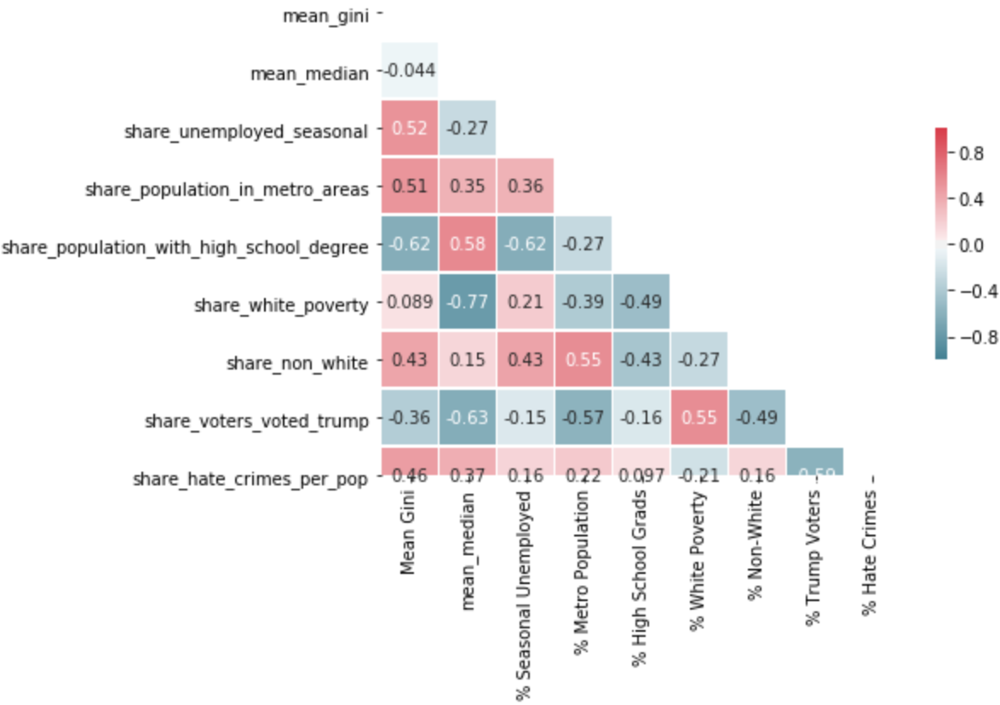
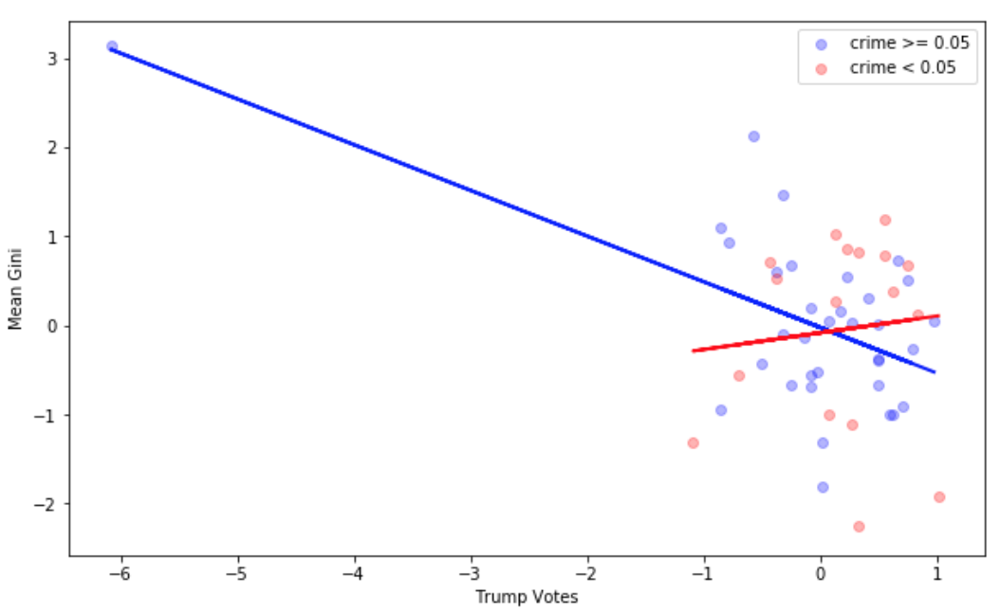
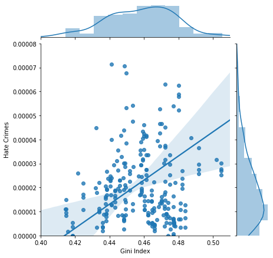

# mod4_project
Goal: Run regression analysis to find any correlations between hate crimes and factors such as Trump voters, income inequality, and average household income per state.

Data:
- U.S. Census data for all 50 states, years 2013 - 2018
  - Reported hate crimes as a proportion of the total population
  - Median household income
  - The Gini coefficient - an economic measure of income inequality
  - Percentage of the population that voted for Trump in 2016 (static variable, data only from 2016 election)
  
  
Tests/Models:
- Pearson coefficient
- QQ Probability Plot
- OLS
- VIF
- Interaction terms
- Ridge/Lasso

Visualizations:

